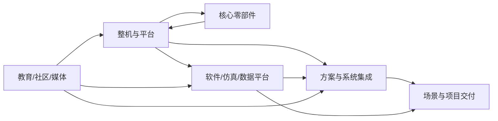

<div align="center">

<h1>Xbotics 具身智能学习路线（Embodied‑AI Guide）</h1>

<p><em>更偏重机器人基础学习与开源项目实践 · 非“教程”，而是可以执行的学习路线与资源导航</em></p>

<!-- TODO: 将下方徽章中的 repo 与 path 替换为你的仓库名 -->

<p>
  <a href="https://github.com/your-org/your-repo"></a>
  
  
  
</p>

</div>

> Xbotics 社区具身智能学习指南：我们把“具身综述→学习路线→仿真学习→开源实物→人物访谈→公司图谱”串起来，帮助新手和实战者快速定位路径、落地项目与参与开源。

---

## 目录

* [0. 使用说明](#0-使用说明)
* [1. 具身综述（Foundations & Map）](#1-具身综述foundations--map)
* [2. 各方向学习路线（Roadmaps）](#2-各方向学习路线roadmaps)
* [3. 仿真学习（Sim Stack）](#3-仿真学习sim-stack)
* [4. 开源实物（Hardware & Field）](#4-开源实物hardware--field)
* [5. 人物访谈（Interviews）](#5-人物访谈interviews)
* [6. 具身公司图谱（Ecosystem Map）](#6-具身公司图谱ecosystem-map)
* [7. 如何使用与贡献](#7-如何使用与贡献)
* [8. 版本与致谢](#8-版本与致谢)

---

## 0. 使用说明

* **定位**：面向新人、进阶与工程落地；以“路线+清单+实作任务”组织，而非长篇教程。
* **风格**：中文为主、英文补充；强调开源项目与可复现。
* **先修建议**：Python / 线性代数 / 概率统计 / 控制基础 / Linux & Git。
* **图标约定**：⭐ 必看 · 🧪 实作 · 🧱 SOP · 📦 代码/数据 · 📄 论文 · 🎥 视频（可选）。
* **结构**：每个小节优先给出可操作的“起步三件事”。

---

## 1. 具身综述（Foundations & Map）

> 目标：建立共同语言与全局地图，统一“方法—数据—硬件—场景”的认知。

### 1.1 概念与术语表 ⭐

* 具身智能定义、与传统机器人/通用大模型关系
* 常见术语：VLA、Diffusion Policy、IL（BC/HybridIL）、RL（离线/在线/HIL‑SERL）、MPC、OCC/BEV、Sim2Real 等
* 📦 **术语表（占位）**：`/glossary/README.md`

### 1.2 方法谱系与技术脉络 ⭐

* 感知→策略→规划→控制的分层与融合
* VLA 与动作表征（token/trajectory/flow）
* Diffusion/Policy Gradients/Model‑Based 控制的接口

### 1.3 数据与评测 🧱

* 数据来源：真机遥操、仿真合成、视频弱监督、混合管线
* 评测指标：成功率、鲁棒性、时延、能耗、安全等级
* 📦 **评测模板（占位）**：`/templates/eval_report.md`

### 1.4 硬件与传感器栈

* 机械臂/灵巧手/移动底盘/人形/四足概览
* 传感器：RGB‑D、力/触觉、IMU、语音；手眼/外参/零位标定

### 1.5 场景地图与工程约束 🧱

* 厨房/商超/化工/装配/检修等典型流程
* 安全与合规：急停/门禁/速度限制/风险分级
* 📦 **SOP（占位）**：`/sop/safety.md`

### 1.6 趋势、机会与常见误区

* 小样真机→大规模视频的数据飞轮
* Sim2Real 的三要素：标定一致性 / 物理参数 / 观测分布
* 误区：只堆模型、忽视工程闭环；只看 Demo、不做评测

---

## 2. 各方向学习路线（Roadmaps）

> 每条路线包含【目标｜先修｜里程碑｜实作任务｜推荐开源】；配套“一页纸”。

### 2.0 共通基座（工具链与可复现） ⭐

* **目标**：Linux/Git/Conda/Docker、数据与实验管理、日志与可观测性
* **里程碑**：跑通一个最小“采集→训练→部署→评测”闭环
* 🧪 **实作**：在 `examples/minimal_pipeline` 复现入门任务

### 2.1 感知：位姿估计与三维重建（弱化 SLAM） ⭐

* **目标**：2D→3D→多模态；物体/手眼位姿、重建、语义场景图
* **里程碑**：L1 6D Pose（合成+少量真机） → L2 多视角/手眼标定 → L3 重建驱动抓取
* 🧪 **实作**：标定脚本与可视化；评估面板
* 📦 **开源**：`links/perception.md`

### 2.2 操作策略：IL / DP / VLA / RL ⭐

* **目标**：从行为克隆到 Diffusion Policy，再到 VLA 与 RL 增强
* **里程碑**：L1 单任务 IL → L2 多任务 VLA/DP → L3 RL 微调与安全约束
* 🧪 **实作**：统一数据格式（HDF/Parquet）、训练与部署脚本
* 📦 **开源**：`links/policy.md`

### 2.3 力控与触觉

* **目标**：阻抗/自适应控制、触觉融合
* **里程碑**：恒力擦拭/插拔 → 触觉引导对位
* 🧪 **实作**：力控安全边界；触觉数据记录与回放
* 📦 **开源**：`links/force_tactile.md`

### 2.4 运动规划与控制

* **目标**：采样/优化规划（RRT*/CHOMP）、MPC 轨迹跟踪、约束处理
* **里程碑**：避障与限位 → 多约束 MPC（速度/电流/力）
* 🧪 **实作**：规划‑控制接口；软限位与保护
* 📦 **开源**：`links/planning_control.md`

### 2.5 空间理解与导航（OCC/BEV）

* **目标**：占据与可达性推理、任务级路径规划
* **里程碑**：静态 OCC → 动态更新与避障 → 任务级接口
* 🧪 **实作**：BEV/OCC 数据管线与可视化

### 2.6 数据工程（采集→清洗→标注→版本化） 🧱

* **目标**：多源数据融合、质量度量、合规管理
* **里程碑**：可复现清洗 → 质量仪表盘与验收标准
* 🧪 **实作**：数据 schema 与校验；许可清单
* 📦 **模板**：`/templates/data_schema.yaml`

### 2.7 系统工程与基础设施

* **目标**：ROS 2/中间件、分布式训练、日志&监控
* **里程碑**：模块化消息规范 → 线上可观测性（metrics/trace/log）
* 🧪 **实作**：CI/CD、远程部署与回滚

### 2.8 评测与复现

* **目标**：任务基准、统计显著性、可复现实验包
* **里程碑**：统一评测脚本+报告模板 → 数据+脚本+权重的复现包
* 🧪 **实作**：`/tools/eval.py` 与 `reports/`

---

## 3. 仿真学习（Sim Stack）

> 强调“选型矩阵→一键模板→问题排查”。

### 3.1 平台总览与选型 ⭐

* Isaac Lab / MuJoCo / ManiSkill / Genesis / Gazebo …
* **选型矩阵（占位）**：

| 维度              | 刚体接触 | 并发/吞吐 | 资产生态 | 渲染 | 录制 | 许可证 |
| --------------- | ---: | ----: | ---: | -: | -: | --: |
| Isaac Lab       |      |       |      |    |    |     |
| MuJoCo          |      |       |      |    |    |     |
| ManiSkill       |      |       |      |    |    |     |
| Genesis         |      |       |      |    |    |     |
| Gazebo/Ignition |      |       |      |    |    |     |

### 3.2 快速上手（云端优先 + 本地）

* 云端实例建议、最小 Demo、成本估算
* 本地环境搭建与常见坑（驱动/依赖/显卡）

### 3.3 资产与场景

* URDF→USD 管线、材质/碰撞、传感器（相机/力/深度）
* 批量资产管理与版本化

### 3.4 任务定义与基准接入

* 观察/动作/奖励设计、录制与回放；单臂/双臂/移动操作基准接入

### 3.5 渲染与域随机

* 外观/光照/动力学随机；合成数据→弱监督
* 合成‑真机分布对齐策略

### 3.6 遥操作与人类数据

* Teleop 接入、时延建模、失败回溯与纠偏录制

### 3.7 Sim2Real 关键路径 🧱

* 标定（手眼/外参/零位）、摩擦/时延建模、策略稳健化
* A/B：仿真→真机一致性验证清单

### 3.8 调试与性能

* 接触发散/穿透、数值稳定性、并发提速
* **排查手册（占位）**：`/troubleshooting/sim.md`

---

## 4. 开源实物（Hardware & Field）

> 以“入门套件→安全标定→MVP 任务→数据工位→项目目录→协作规范”组织。

### 4.1 入门套件与采购建议 ⭐

* 机械臂/夹爪/相机/控制器最小清单（可含租赁）与预算区间
* 布线与工装建议，供货与维护注意事项
* **清单（占位）**：`/hardware/bom.md`

### 4.2 标定与安全 🧱

* 手眼标定流程、零位/软限位、安全联锁（急停/门禁/速度限制）
* 安全培训与演练记录模板
* **SOP（占位）**：`/sop/calibration.md`, `sop/safety.md`

### 4.3 MVP 任务清单（示例 10 项）

| 任务    | 输入/传感    | 关键技术              | 成功判据      | 指标      |
| ----- | -------- | ----------------- | --------- | ------- |
| 抓取‑放置 | RGB‑D    | 6D Pose / 轨迹/夹爪控制 | 正确位置与姿态落台 | 成功率/用时  |
| 对位‑插接 | RGB‑D/触觉 | 视觉对位+阻抗/力控        | 无损插合      | 成功率/峰值力 |
| 恒力擦拭  | 力/扭矩     | 阻抗+轨迹             | 匀速匀力、无打滑  | 平滑度/平均力 |
| 分类打包  | 视觉/语义    | VLA/多任务策略         | 按类装箱      | 准确率/吞吐  |
| ……    |          |                   |           |         |

> 更多样例见 `examples/field_mvp/`。

### 4.4 数据采集工位

* 光照/相机/治具、遥操（现成设备 vs 自研）
* 数据 schema/命名规范/存储与备份、隐私与授权
* **模板**：`/templates/dataset_contract.md`

### 4.5 实战项目目录（按 Xbotics 场景）

* 厨房/商超/化工/装配等：每项含目标、KPI、风险与复现场景包

### 4.6 开源贡献与协作

* 仓库结构、Issue/PR 规范、数据许可（开源/商用）
* 演示素材：视频/日志/评测报告模板

---

## 5. 人物访谈（Interviews）

> 以基础学习与开源项目为导向的深度文字访谈；聚焦“怎么做到了”。

### 5.1 采访对象池（长期更新）

* 学术：具身/触觉/规划与控制/Sim2Real 研究者
* 开源作者：仿真平台、VLA/DP 框架、数据工具链
* 公司一线工程师：场景落地、SOP、评测与复现
* 产品与运营：从需求到方案，成本与交付
* 产业观察与投资：商业化路径、指标与风险

### 5.2 采访问题模板（可复用）

1. 你们在做的核心问题是什么？为什么难？
2. 最小可行解（MVP）是如何确定与迭代的？
3. 数据路线：采集/清洗/标注/版本化，踩过的坑？
4. 评测与复现：如何定义可比性与稳定性？
5. 开源经验：结构、贡献、社区协作的关键做法？
6. 商业化（可选）：客户价值、交付约束与安全合规？

* **格式**：Markdown 文字稿 + 关键图表（Mermaid/图片）
* **提交流程**：使用 Issue 模板 `/.github/ISSUE_TEMPLATE/interview.yaml`
* **发布渠道（建议）**：GitHub Discussions / 社区公众号 / B 站图文

---

## 6. 具身公司图谱（Ecosystem Map）

> 以“类别→子类→代表链接”的方式组织，强调学习与协作角度；示例仅作占位，欢迎补充与纠偏。

### 6.1 分类表（占位，可增删）

| 类别      | 子类                       | 说明      | 示例（可替换/补充）                             |
| ------- | ------------------------ | ------- | -------------------------------------- |
| 整机      | 人形 / 四足 / 移动操作 / 桌面机械臂   | 完整系统与平台 | （示例占位）Unitree, Agility, Figure, Franka |
| 方案与系统集成 | 行业/场景方案商                 | 从需求到交付  | （示例占位）                                 |
| 核心零部件   | 执行器/减速器/电机/电控/传感器/夹爪/灵巧手 | 关键硬件    | （示例占位）Robotiq, OnRobot                 |
| 软件与平台   | 仿真/数据/训练/评测/MLOps        | 工具链     | （示例占位）Isaac Lab, MuJoCo, ManiSkill     |
| 教育与社区   | 课程/竞赛/媒体/社区              | 人才与生态   | （示例占位）                                 |

> **贡献方式**：在 `ecosystem/companies.yaml` 添加/更新条目；PR 需附公开来源链接与类别说明。

### 6.2 Mermaid 关系图（简要）



---

## 7. 如何使用与贡献

### 7.1 我该怎么用？

* 先读 **[1.综述]** 建立地图 → 选一条 **[2.路线]** → 跑通 **最小闭环** → 在 **[3/4]** 中选“仿真/真机”路径落地。
* 每条路线自带 **一页纸** 与 **实作任务**；先做后扩展，不贪多。

### 7.2 贡献指南（简化）

1. Fork & 新建分支；
2. 遵循 `/templates/` 模板补充内容；
3. 在对应 `links/*.md` 加入高质量链接（不刷量）；
4. 提交 PR，附变更说明与可复现步骤；
5. Maintainer 1–2 位审核合入（按周批次）。

* **目录结构建议**：

```
.
├── glossary/
├── links/               # 各方向高质量链接清单
├── templates/           # 报告/数据/Issue/PR 模板
├── sop/                 # 安全/标定/部署 SOP
├── tools/               # 评测脚本、可视化工具
├── troubleshooting/     # 常见问题排查
├── examples/            # 仿真与真机最小样例
├── ecosystem/           # 公司图谱等生态数据
└── interviews/          # 人物访谈（文字稿、资源）
```

* **Issue 模板**：`new-link.yaml`、`bug.md`、`interview.yaml`、`company-add.yaml`
* **内容规范**：

  * 中文为主，标题使用句式化小标题；
  * 外链需可公开访问，附一句话理由；
  * 代码/脚本需可复现（含依赖与命令）。

### 7.3 许可

* 文档：**CC BY 4.0**；代码与脚本：**MIT**。提交内容默认同意遵循本仓库许可。

---

## 8. 版本与致谢

* **版本节奏**：每周一同步合入；月末发布小版本（Changelog）。
* **维护团队**：Xbotics 社区志愿者 & 合作伙伴。
* **致谢**：感谢所有贡献者的链接推荐、SOP 总结与复现实验。

> 💡 有想加入的方向？直接开 Issue；也欢迎在 Discussions 里提需求与想法。
